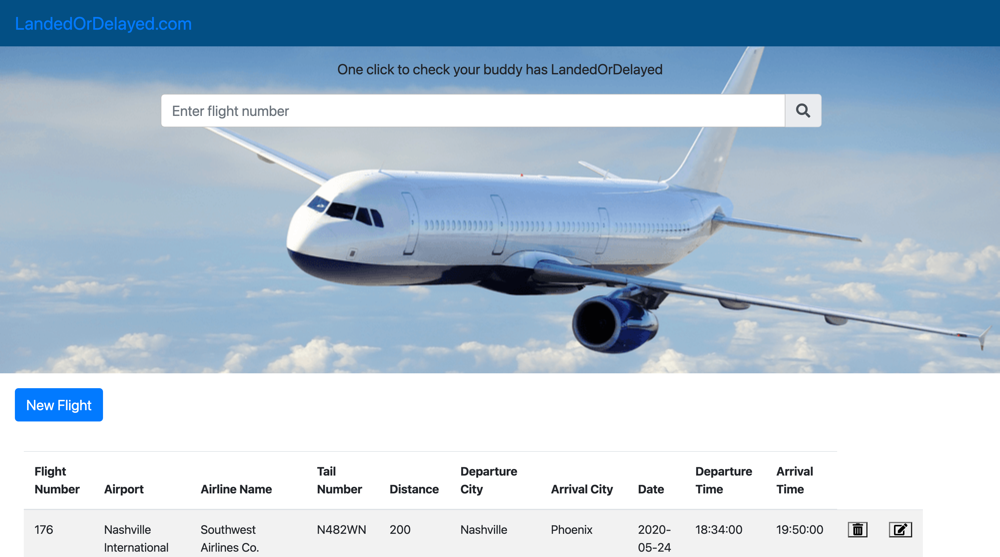

# Full stack Flight API

This Repositary containes `Database`, `BackEnd` and `FrontEnd` Files:

In the begining loaded the data from [Kaggle](https://www.kaggle.com/usdot/flight-delays?select=airports.csv) for Flights, Airline and Airports.

Using Panda to load the data in the `Python` file then make some tranformation and loading it to `MySQL` Database.

In the BackEnd Used `JAVA` language to make the connection to the database using `DOA` design and doing queries.

 Using `Servlet` container for hosting web applications on web servers(`TomCat`) and build our API's.

 In FronEnd `HTML` used to describe a web page, appearance and presentation using `CSS` and  functionality and behavior by `JavaScript`.

### Interactive Web Page - LandedOrDelayed.com

